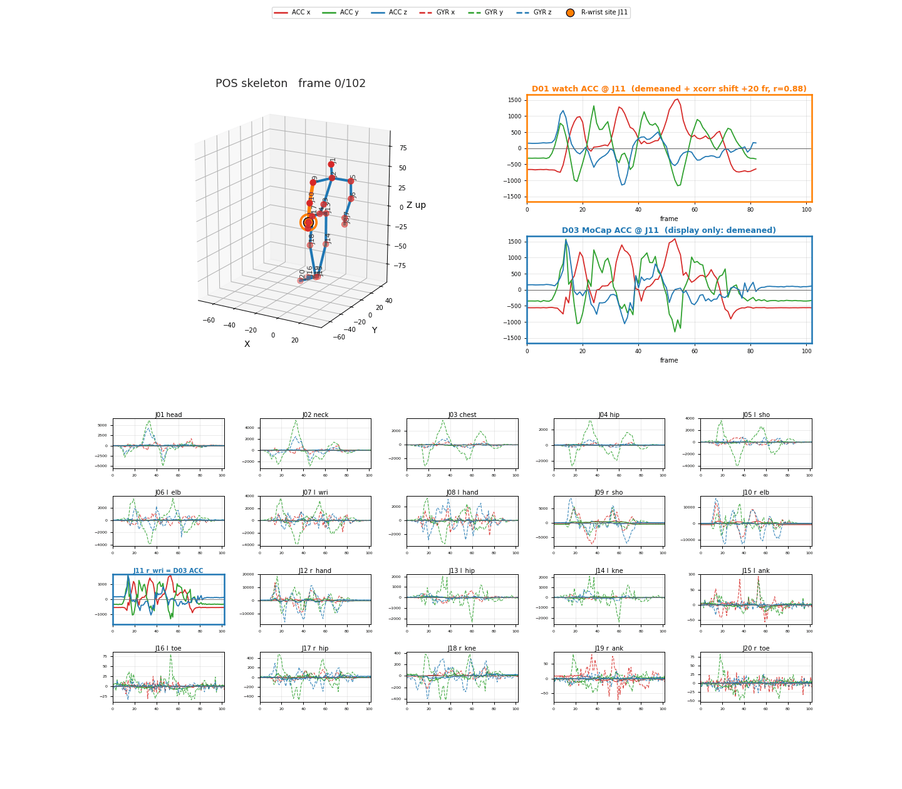
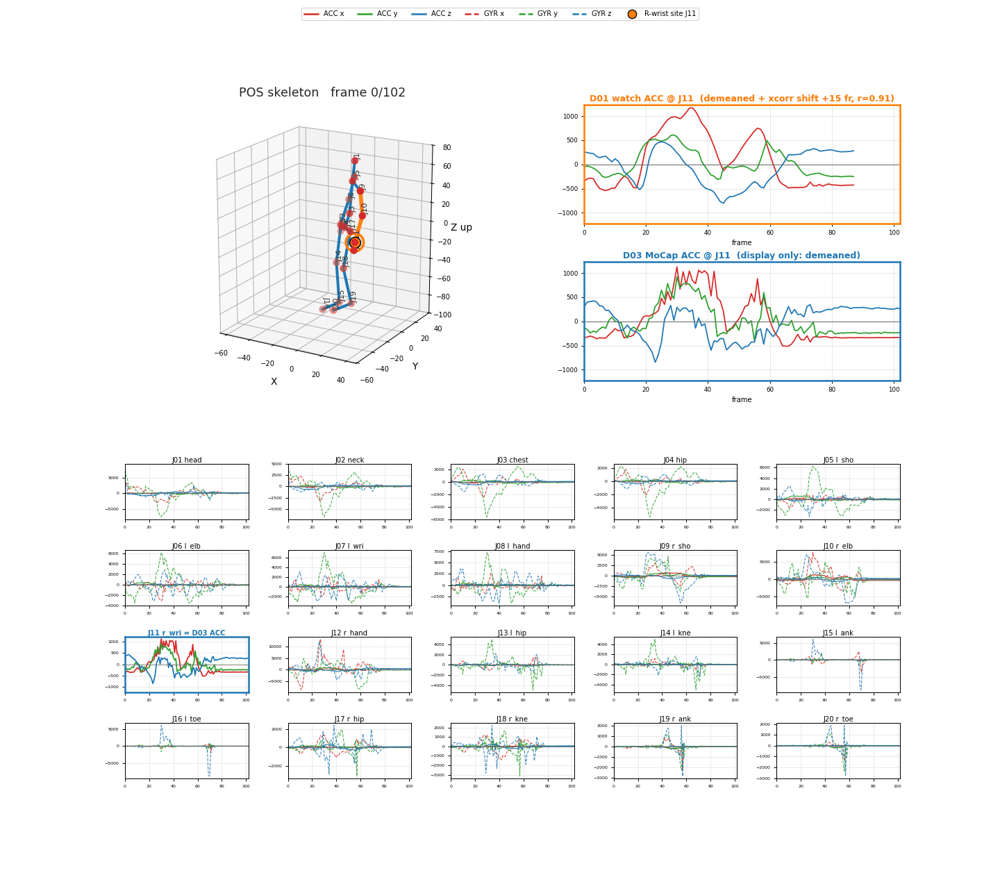
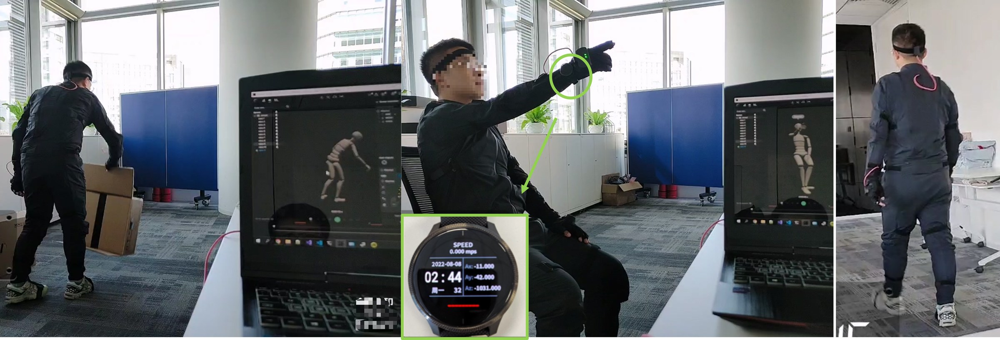
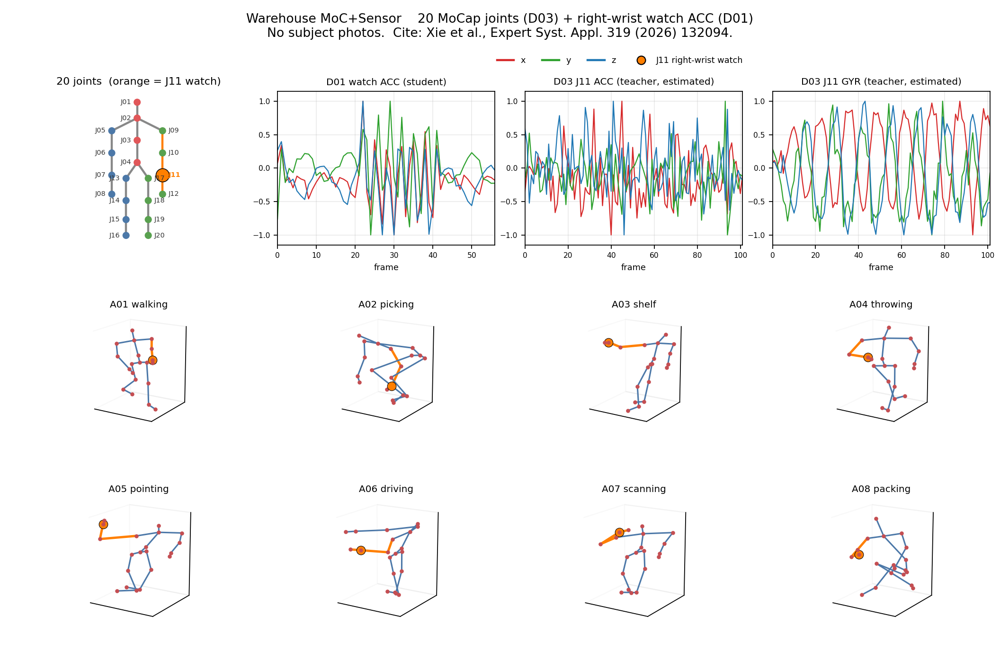

# Warehouse MoC+Sensor（中文说明）

仓库作业动作数据集。公开形态是 **两个 zip**（里面是 npy 时间序列，不含 GAF）。不必解压，`scripts/load_clip.py` 直接从 zip 读。

## 请引用

**Xie, Yulai; Fu, Yijia; Xu, Qing; Ren, Fang.**  
Sensor-to-Sensor procedural co-learning for sensor-limited human action recognition.  
*Expert Systems with Applications*, **319**, 132094, 2026.  
DOI: [10.1016/j.eswa.2026.132094](https://doi.org/10.1016/j.eswa.2026.132094)

完整英文说明见 [README.md](README.md)。

## 这个库最特别的地方

不是「只有骨架」，也不是「只有一块表」。**每一条样本同时有：**

1. **全身动捕（D03）**：**20 个关节**，且**每个关节都有 POS / ACC / GYR**（位置、加速度、角速度，每关节 9 维）。
2. **真实右手腕加速度（D01）**：同场次佩戴的 **Garmin Venu 真表** 右腕加速度（对应关节 **J11**）——是真实传感器，不是从动捕再估出来的假腕表。

也就是说：**全身富信号老师 + 可上线的真实学生腕表**，成对、对齐在同一批仓库动作上。

示例 clip `A0501_S0101_T009`（**指向检查**）：左骨架（橙色 = **J11**）；右侧两个**同尺寸、同纵轴**对比图：**D01 真表 ACC** vs **D03 J11 动捕 ACC**（**仅展示：demean + 可选互相关时移**）。下方关节格：去均值 ACC + GYR。

示例 clip `A0301_S0101_T006`（**上架**）：同上画法。

采集现场（作者照片）：左弯腰搬箱 / 中 **指向**（绿圈手表）/ 右站立；表盘特写 ACC（静止时 Az≈−1031，接近重力）。

## 对齐方式（D01 与 D03 怎么对应）

论文里「对齐」有两层含义；**本仓库原始 npy** 只直接提供第一层。

### 1. 数据配对（本仓库）

- **同一场次、同一动作窗。** 手表（D01）与动捕（D03）同采。受试者按 **节拍口令** 做动作；每个子动作根据 **同步视频 + 节拍** **人工切段**（论文 §5.1.3）。同一个 `clip_id`（如 `A0201_S0101_T002`）就是同一条标注好的样本。
- **不是逐帧等长。** 几乎每条都有 `len(D01) ≠ len(D03)`（约 10 Hz 下中位差约 **26** 帧）。两边对齐的是**标注后的动作区间**，不是共享同一个采样下标。
- **论文训练不把两边重采样到同一 `T`。** 每条 3 轴序列先 min-max 到 **[-1, 1]**，再做成固定大小的 **GAF** 图（**224×224** RGB）。不同长度/采样率变成同尺寸图，共学管线**不需要** D01↔D03 逐帧扭曲（论文 §5.2 / Fig. 4）。**本仓库只发原始 npy，不含 GAF。**
- **若你自己做时序模型：** 需自选时间对齐（例如把一方线性重采样到另一方的 `T`，或裁到 `min(T1,T3)`）。`scripts/load_clip.py` 原样返回两边数组。
- **预览 GIF ≠ 原始 npy：** demean / 重采样 / 可选互相关时移等仅用于画图，详见 [`docs/20260914_0020_note_raw_vs_demo.md`](docs/20260914_0020_note_raw_vs_demo.md)（英文）。

### 2. 模型多层对齐（论文方法，不是额外数据文件）

共学框架的五级对齐（论文 §4 / Fig. 3）属于**网络训练**，不是第二套时间戳文件：

| 层级 | 对齐什么 |
|-----:|----------|
| 1 | **统一输入** — GAF，把不同长度序列变成同尺寸图 |
| 2 | **输入** — Pre-adaptive（Conv-BN-ReLU + skip），把学生通道映到老师侧 |
| 3 | **结构** — 师生同一 backbone（如 ResNet18） |
| 4 | **特征** — MSE + **LSCA**（分层结构对比对齐） |
| 5 | **输出** — 分类 CE（+ 可选 KD） |

读论文方法时看这一层；**不改变** zip 里原始 npy 的布局。

更多通道说明见 [`metadata/channels.md`](metadata/channels.md)。

## 八类仓库动作（论文）

按真实物流/仓库作业规范定义（论文 §5.1.3 / Fig. 6）。识别标签是 **8 类**：`label = int(clip_id[1:3]) - 1`（A01…A08）。文件名里还有 **25** 个子类，完整表见 [`metadata/actions.csv`](metadata/actions.csv)。

| 编号 | 代码 | 英文名（论文） | 中文含义 | 受试者做什么 | 子类举例 |
|-----:|------|----------------|----------|--------------|----------|
| 0 | **A01** | Walking | **行走** | 在作业区行走；可推车或拉车 | 走；推车走；拉车走 |
| 1 | **A02** | Picking | **拣货 / 放下** | 双手或右手取放货物 | 双手放下；右手掌上/掌下放下 |
| 2 | **A03** | Shelf | **上架** | 右手把物品放到货架上 | 仅 `A0301`（样本最少的一类） |
| 3 | **A04** | Throwing | **投掷** | 轻扔 / 远扔 / 双手扔 | 右手轻扔；右手远扔；双手轻扔 |
| 4 | **A05** | Pointing check | **指向检查** | 站姿或坐姿做左右前指检（安全确认） | 站立指检；坐姿指检 |
| 5 | **A06** | Lift-car driving | **叉车驾驶** | 模拟叉车：方向盘 + 操纵杆等 | 方向盘+杆；部分受试者另有驾驶/转弯子类 |
| 6 | **A07** | Idle / scanning | **空闲 / 扫码** | 站/坐空闲，或站/蹲扫条码 | 站着没事；坐着没事；站扫码；蹲扫码 |
| 7 | **A08** | Packing | **打包** | 开箱、装填、封箱、贴胶带 | 打包长序列拆成 `A0801` / `A0802` |

9 名受试者，各子动作约 **10** 次，节拍口令同步。剔除无效后 **1768** 条，均长约 **9** 秒。

首页上方 GIF：**A05 指向** 与 **A03 上架**（弯腰拣货预览已去掉）。八类各一条官方有效 clip 动图：

| 类别 | Clip | GIF |
|------|------|-----|
| A01 行走 | `A0101_S0101_T008` | [gif](assets/previews/A01_walk_A0101_S0101_T008.gif) |
| A02 拣货 | `A0201_S0101_T002` | [gif](assets/previews/A02_picking_A0201_S0101_T002.gif) |
| A03 上架 | `A0301_S0101_T006` | [gif](assets/previews/A03_shelf_A0301_S0101_T006.gif) |
| A04 投掷 | `A0401_S0101_T010` | [gif](assets/previews/A04_throwing_A0401_S0101_T010.gif) |
| A05 指向 | `A0501_S0101_T009` | [gif](assets/previews/A05_pointing_A0501_S0101_T009.gif) |
| A06 驾驶 | `A0601_S0101_T010` | [gif](assets/previews/A06_driving_A0601_S0101_T010.gif) |
| A07 扫码 | `A0703_S0101_T005` | [gif](assets/previews/A07_scanning_A0703_S0101_T005.gif) |
| A08 打包 | `A0801_S0101_T007` | [gif](assets/previews/A08_packing_A0801_S0101_T007.gif) |

## 采集设备

| 角色 | 设备（论文写法） | 佩戴 / 用法 | 本仓库给出的量 | 采样率 |
|------|------------------|-------------|----------------|--------|
| 学生 / 真传感器（**D01**） | **Garmin Venu** 智能手表 | **右手腕** | 仅加速度 **xyz**（`(T,3)`）；无手表陀螺、无手表位姿 | 约 **10 Hz** |
| 老师 / 动捕（**D03**） | **Rokoko** 专业动捕服 | 全身 | Rokoko → **UE4（Unreal Engine 4）** 虚传感器导出：**20 关节 ×（POS, ACC, GYR）**，每关节 `(T,9)` | 约 **10 Hz** |

### 手表：Garmin Venu（D01）

- 论文原文：*a single Garmin VENU smartwatch on the right wrist*（佳明 **Venu** 系列）。
- 佩戴位点与动捕 **J11**（右腕）对应。
- 公开发布模态：**只有加速度**。表机可能还有别的传感器，**本数据集不提供**手表陀螺仪 / 朝向 / GPS。
- 数值为整数量化（不保证国际单位），细节见英文 [`metadata/channels.md`](metadata/channels.md)。

### 动捕：Rokoko 服 → UE4（D03）

- 论文原文：*a professional ROKOKO motion capture suit*，全身估计 **位置 POS、加速度 ACC、角速度 GYR**，共 **20** 个关节。
- 采集流水线（内部说明）：**Rokoko take → 导入 UE4 → 虚传感器 → CSV → `.npy`**。公开文件是最终 npy（在 `D03_mocap_joints.zip` 里），不含 Rokoko 原始工程或 UE4 工程。
- 相对 Kinect/RGB 骨架：惯性动捕服，**不怕遮挡**；关节树与论文 Fig.6 / 本仓关节图一致（**J11 = 右腕**）。
- 论文与公开脚本**没有写死** Rokoko 具体子型号（如 Smartsuit Pro / Pro II）；对外请写 **Rokoko 专业动捕服**，除非你另有资产台账。

### 同步与场景

- 仓库/物流动作，节拍口令；录完后用标注工具切段。
- 同一 clip 的 D01/D03 是**同一段动作窗口**，但帧数 `T` 通常不等（中位差约 26 帧）。做时序模型需自行重采样；论文用 GAF（本仓不提供）故训练时不要求逐帧对齐。

## 信号总览

橙色点 = 右腕手表 **J11**。重画总览：`python3 scripts/plot_overview.py`。

## 数字

- 原始成对 clip：**1870**
- 论文有效：**1768**（train 1241 / test 527，按人划分：前 6 人 / 后 3 人）
- 无效：**102** 条 → `splits/abnormal_clips.txt`

## 文件

- 手表 zip：`data/D01_watch_acc.zip`（约 1.3 MB）→ **Garmin Venu 真实右腕 ACC**
- 动捕 zip：`data/D03_mocap_joints.zip`（约 58 MB）→ **Rokoko→UE4，20 关节 × POS+ACC+GYR**
- 右腕手表位置对应 **J11**

## 无效原因（102）

| 原因 | 条数 |
|------|------|
| 手表空 | 49 |
| 手表过短 T&lt;40 | 35 |
| 长度够但波形坏 | 10 |
| 动捕过短/空等 | 8 |

不要用「双方 T≥40」代替这份名单。

## 致谢

感谢 **张燕飞** 先生和 **王晓辉** 先生在数据采集和整理过程中做出的贡献。

## 缩略语

HAR = Human Action Recognition，人体动作识别；MoC = Motion Capture，动捕；POS/ACC/GYR = position/acceleration/gyroscope，位置/加速度/角速度；GAF = Gramian Angular Field，格拉姆角场（本仓库不提供）；D01 = 真表（Garmin Venu）；D03 = Rokoko→UE4 虚传感器；UE4 = Unreal Engine 4，虚幻引擎 4。
